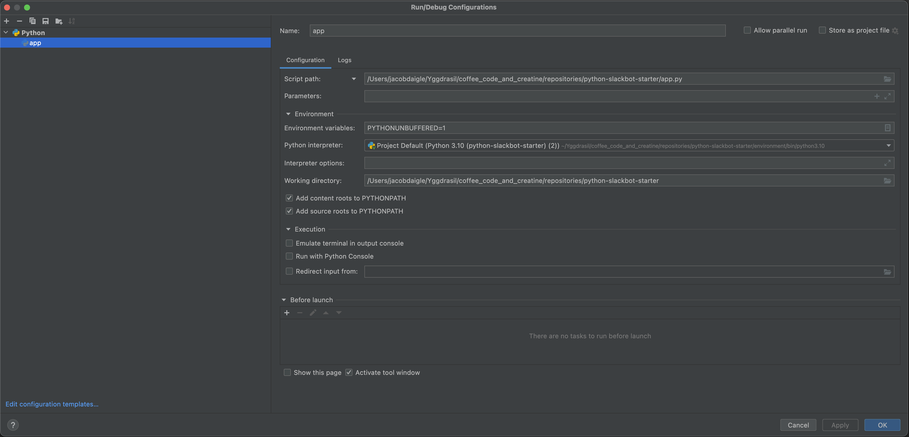

# Python Slack Starter

- This readme is more of a reference page for commands to get the project running and various slack resources.
  - For a full video based tutorial, see [WATCH_ME](https://youtu.be/uP2T22AXAuA)

## Project Requirements
- Python 3.10.0

## Set Python Virtual Env & Running App
Creating and activating python env
```bash
python -m venv environment
source environment/bin/activate
```

Installing requirements
```bash
pip install -r requirements.txt
```

Running Project via IDE


Starting ngrok
```bash
ngrok http 4000
```

## Slack References
- [Slack App Page](https://api.slack.com/apps)
- [Verifying Slack Requests](https://api.slack.com/authentication/verifying-requests-from-slack)
- [Messages & Webhooks](https://api.slack.com/messaging/webhooks)

## Other Tools
- [Json Editor](https://jsoneditoronline.org)
- [ngrok](https://ngrok.com/)